```mermaid
%%{init: {'flowchart': {'defaultRenderer': 'elk', 'nodeSpacing': 28, 'rankSpacing': 48}}}%%
graph LR

    subgraph cfg["Config"]
        direction TB
        AppConfig
        ConfigIO
    end

    subgraph math_g["Math"]
        direction LR
        Vec2
        MathConstants
        Bezier
        StrokePath
    end

    subgraph phys["Physics"]
        direction TB
        Geometry
    end

    subgraph chardata["Character · Data"]
        direction LR
        CMState
        FootState
        TrailPoint
        UpperBodyTypes
        BalanceState
        SupportState
    end

    subgraph charlogic["Character · Logic"]
        direction LR
        CharacterState
        ArmController
        HeadController
        UpperBodyKinematics
    end

    subgraph loco["Locomotion"]
        direction LR
        BalanceComputer
        LegIK
        StandingController
    end

    subgraph sim_g["Simulation"]
        direction LR
        InputFrame
        SimState
        SimulationCore
        GroundReference
        WorldConstants
        SimVerbosity
    end

    subgraph tele["Telemetry"]
        direction LR
        TelemetryRow
        TelemetryRecorder
    end

    subgraph terra["Terrain"]
        direction TB
        Terrain
    end

    subgraph rt["Runtime"]
        direction TB
        SimulationLoop
    end

    subgraph hl["Headless"]
        direction LR
        ScenarioDef
        ScenarioLibrary
        ScenarioRunner
    end

    subgraph rend["Render"]
        direction LR
        Camera2D
        DustParticle
        StrokeRenderer
        SceneRenderer
        CharacterRenderer
        DebugOverlayRenderer
    end

    subgraph app_g["App"]
        direction LR
        AudioSystem
        EffectsSystem
        InputController
        Application
    end

    subgraph dbg["Debug"]
        direction TB
        DebugUI
    end

    %% Horizontal layout spine
    AppConfig ~~~ Vec2
    Vec2 ~~~ CMState
    CMState ~~~ CharacterState
    CharacterState ~~~ BalanceComputer
    BalanceComputer ~~~ SimulationCore
    SimulationCore ~~~ TelemetryRecorder
    TelemetryRecorder ~~~ ScenarioRunner
    ScenarioRunner ~~~ SceneRenderer
    SceneRenderer ~~~ Application
    Application ~~~ DebugUI

    %% Math
    Vec2        --> MathConstants
    Bezier      --> Vec2
    StrokePath  --> Bezier

    %% Physics / geometry helpers
    Geometry --> MathConstants

    %% Character data (leaves use Vec2 only — not shown)
    CMState          --> Vec2
    FootState        --> Vec2
    TrailPoint       --> Vec2
    UpperBodyTypes   --> Vec2

    %% Character logic
    CharacterState      --> Vec2
    CharacterState      --> CMState
    CharacterState      --> FootState
    CharacterState      --> AppConfig
    ArmController       --> AppConfig
    ArmController       --> CMState
    ArmController       --> CharacterState
    HeadController      --> AppConfig
    HeadController      --> CharacterState
    UpperBodyKinematics --> AppConfig
    UpperBodyKinematics --> ArmController
    UpperBodyKinematics --> HeadController
    UpperBodyKinematics --> UpperBodyTypes

    %% Locomotion
    BalanceComputer   --> BalanceState
    BalanceComputer   --> CMState
    BalanceComputer   --> SupportState
    BalanceComputer   --> AppConfig
    LegIK             --> Vec2
    StandingController --> SupportState
    StandingController --> CMState
    StandingController --> FootState
    StandingController --> AppConfig
    StandingController --> Geometry

    %% Terrain
    Terrain -.-> AppConfig
    Terrain     --> Vec2

    %% Simulation
    InputFrame      --> Vec2
    SimState        --> CMState
    SimState        --> CharacterState
    SimulationCore -.-> AppConfig
    SimulationCore  --> Terrain
    SimulationCore  --> SimState
    SimulationCore  --> InputFrame
    GroundReference --> AppConfig
    GroundReference --> CharacterState
    GroundReference --> CMState
    GroundReference --> Terrain

    %% Telemetry
    TelemetryRow      --> CharacterState
    TelemetryRecorder --> TelemetryRow
    TelemetryRecorder --> SimState

    %% Config
    ConfigIO --> AppConfig

    %% Headless
    ScenarioDef     --> SimState
    ScenarioDef     --> InputFrame
    ScenarioDef     --> TelemetryRecorder
    ScenarioLibrary --> AppConfig
    ScenarioLibrary --> ScenarioDef
    ScenarioRunner  --> AppConfig
    ScenarioRunner  --> ScenarioDef

    %% Render
    Camera2D            --> Vec2
    DustParticle        --> Vec2
    SceneRenderer       --> Camera2D
    SceneRenderer       --> DustParticle
    SceneRenderer       --> Terrain
    SceneRenderer       --> AppConfig
    CharacterRenderer   --> Camera2D
    CharacterRenderer   --> CMState
    CharacterRenderer   --> CharacterState
    CharacterRenderer   --> Terrain
    CharacterRenderer   --> AppConfig
    CharacterRenderer   --> StrokeRenderer
    DebugOverlayRenderer --> Camera2D
    DebugOverlayRenderer --> CMState
    DebugOverlayRenderer --> CharacterState
    DebugOverlayRenderer --> Terrain
    DebugOverlayRenderer --> AppConfig
    DebugOverlayRenderer --> TrailPoint

    %% App
    EffectsSystem   --> AppConfig
    EffectsSystem   --> SimState
    EffectsSystem   --> DustParticle
    InputController --> AppConfig
    InputController --> InputFrame
    InputController --> SimulationCore
    InputController --> Camera2D
    Application     --> AppConfig
    Application    -.-> SimulationCore
    Application     --> SimulationLoop
    Application     --> Camera2D
    Application     --> SceneRenderer
    Application     --> CharacterRenderer
    Application     --> DebugOverlayRenderer
    Application     --> DebugUI
    Application     --> AudioSystem
    Application     --> EffectsSystem
    Application     --> InputController
    Application     --> TrailPoint

    %% Debug UI
    DebugUI --> SimulationLoop
    DebugUI --> Terrain
    DebugUI --> Camera2D
    DebugUI --> CMState
    DebugUI --> CharacterState
    DebugUI --> AppConfig
```

## Découpage physique des implémentations

Le diagramme ci-dessus décrit les **modules logiques**. Dans le code source, deux
modules importants sont maintenant répartis sur plusieurs fichiers
d'implémentation sans changer leur API publique :

- `SimulationCore`
  - `src/core/simulation/SimulationCore.cpp`
  - `src/core/simulation/SimulationCoreLifecycle.cpp`
  - `src/core/simulation/SimulationCoreLocomotion.cpp`
  - `src/core/simulation/SimulationCoreInternal.h` pour les helpers internes partagés
- `Math` / `Physics`
  - `src/core/math/Vec2.cpp` contient les opérations de `Vec2`
  - `src/core/physics/Geometry.cpp` contient les helpers géométriques partagés
- `Character`
  - `src/core/character/SupportState.cpp` contient les petites méthodes de support
  - `src/core/character/UpperBodyKinematics.cpp` coordonne bras et tête
- `DebugUI`
  - `src/debug/DebugUI.cpp`
  - `src/debug/DebugUICharacterPanels.cpp`

Cette séparation est purement structurelle : le graphe de dépendances au niveau
des modules reste inchangé.
