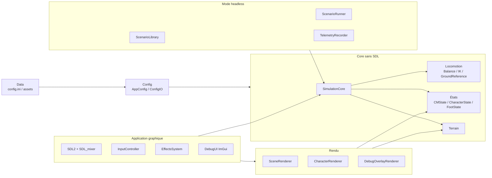
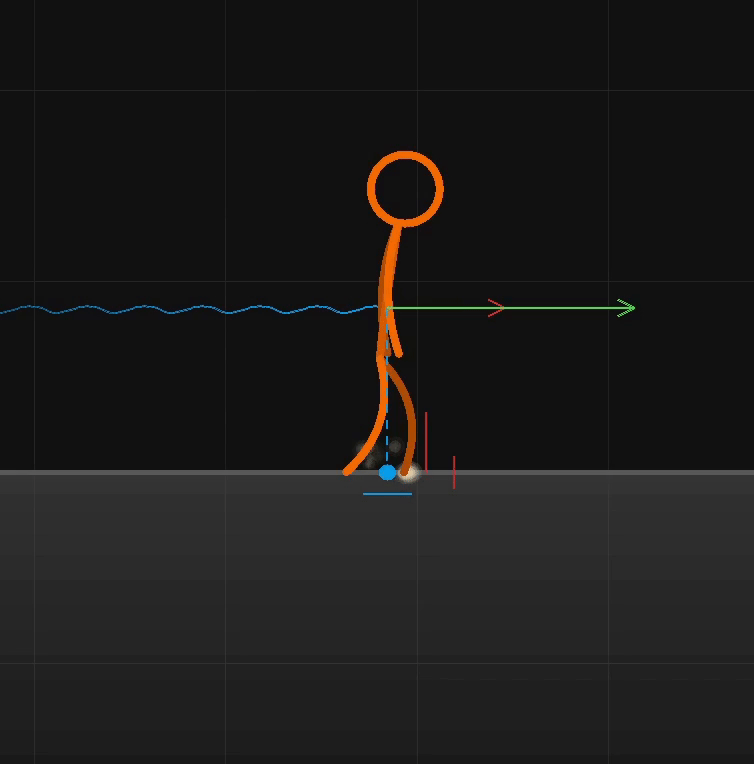
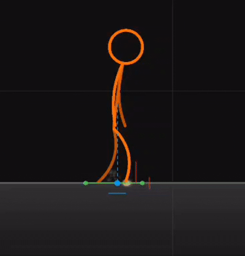
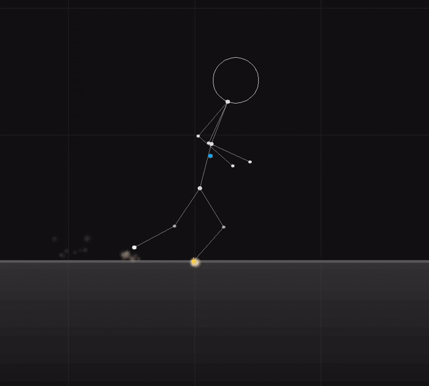

# Contenu complet de la présentation — BobTricks

Ce document contient le contenu prêt à transformer en slides : texte visible,
images à préparer, dialogue oral détaillé, snippets de code, équations,
références scientifiques et liens avec les critères d'évaluation.

Durée cible : **15 minutes présentation + démonstration**, puis **5 minutes de
questions**.

Répartition :

| Intervenant | Rôle |
|-------------|------|
| Tomas | Physique, mathématiques, centre de masse, XCoM, triggers, terrain. |
| Meleik | Rendu, interface, overlays, partie visible de la démonstration. |
| Gedik | Headless, tests, Makefile, organisation, documentation, Windows/Linux. |

## Slide 1 — Titre

### Texte sur la slide

**BobTricks**  
Locomotion procédurale 2D en C++20

Tomas, Meleik, Gedik

Mots-clés :

- centre de masse ;
- marche procédurale ;
- rendu SDL2 ;
- validation headless.

### Image à mettre

GIF principal recommandé :


Utilisation :

- image d'ouverture propre, sans overlay technique ;
- personnage en posture dynamique ;
- preuve immédiate que la locomotion est visible et lisible.

### Dialogue — Tomas

> Bonjour, nous allons présenter BobTricks, un système de locomotion procédurale
> 2D. L'objectif n'était pas simplement d'afficher un personnage animé, mais de
> construire une marche calculée à partir d'un modèle physique simplifié.

> Le personnage ne joue pas une animation préenregistrée. Son centre de masse est
> intégré par la simulation, puis les pieds, les jambes, le torse, les bras et le
> rendu sont reconstruits à partir de cet état.

> La présentation suit donc trois idées : d'abord la physique de la locomotion,
> ensuite la visualisation, puis la validation automatique et l'organisation du
> projet.

### Critères visés

- Impression d'ensemble.
- Difficulté apparente.
- Clarté de présentation.

## Slide 2 — Ce que l'application sait faire

### Texte sur la slide

Fonctionnalités principales :

- marcher et s'arrêter ;
- courir avec transition marche-course ;
- sauter et atterrir ;
- adapter les pieds au terrain ;
- afficher des overlays de debug ;
- exécuter des scénarios headless ;
- lancer le projet sous Linux et Windows.

### Images à mettre

Montage recommandé :


Ces trois GIFs montrent respectivement :

1. marche normale ;
2. course ;
3. overlay de debug avec XCoM / cible de pas / déclenchement.

### Dialogue — Meleik

> Visuellement, l'application montre un personnage 2D qui peut marcher, courir,
> sauter et se déplacer sur le terrain.

> La partie importante est que le rendu n'est pas isolé de la simulation. Les
> overlays permettent de voir ce que la simulation calcule : le centre de masse,
> les pieds, les arcs de swing, les références de sol et les informations de
> stabilité.

> Pendant la démo, je montrerai la partie visible : le rendu du personnage, les
> overlays et le comportement en mouvement.

### Critères visés

- Finition.
- Interface complète.
- Utilisation de SDL2.
- Démo claire.

## Slide 3 — Architecture générale

### Texte sur la slide

Architecture par responsabilités :

```text
src/core/      physique, locomotion, terrain, états
src/render/    rendu SDL2, caméra, personnage, overlays
src/debug/     interface ImGui de réglage
src/headless/  scénarios sans fenêtre graphique
src/config/    configuration et fichiers INI
src/app/       orchestration SDL, input, audio, effets
tests/         unitaires et régressions
data/          configuration et assets
doc/           UML, Gantt, maths, décisions, présentation
```

Deux chemins d'exécution :

```text
Application graphique SDL2
        |
        v
SimulationCore
        ^
        |
Binaire headless sans SDL
```

### Diagramme à mettre

Version simplifiée du diagramme Mermaid de `doc/class_diagram.md`, adaptée à une
slide. Le diagramme complet reste dans la documentation projet.



### Dialogue — Gedik

> La conception est séparée par responsabilités. Le point central est
> `SimulationCore`, dans `src/core`. Il ne dépend pas de SDL.

> Autour de lui, on a deux chemins. Le premier est l'application graphique :
> SDL2, rendu, debug UI, input, audio et effets. Le second est le mode headless :
> il exécute les mêmes règles de simulation, mais sans fenêtre graphique.

> Cette séparation répond directement au critère de modularité. Elle permet de
> tester la marche sans dépendre du rendu, et aussi de travailler en parallèle :
> physique, rendu et validation ne sont pas mélangés.

### Snippet — Makefile

À afficher en petit ou à garder en backup :

```makefile
# Application graphique
SRC_DIRS := src src/app src/config \
            src/core/math src/core/character src/core/locomotion \
            src/core/runtime src/core/simulation src/core/telemetry \
            src/core/terrain src/render src/debug

# Binaire headless : sans SDL, sans ImGui, sans Camera2D
HEADLESS_DIRS := src/config \
                 src/core/character src/core/locomotion \
                 src/core/simulation src/core/telemetry src/core/terrain \
                 src/headless
```

Explication du snippet :

- le build graphique inclut `render`, `debug`, `app` et les bibliothèques SDL ;
- le build headless ne garde que `core`, `config`, `terrain`, `telemetry` et
  `headless` ;
- cela prouve que l'interface graphique est réellement séparée du noyau.

### Critères visés

- Qualité de conception.
- Modularité de l'interface.
- Organisation des fichiers.
- Compilation Makefile.

## Slide 4 — Idée physique : le centre de masse est la vérité

### Texte sur la slide

Décision centrale :

> Le centre de masse est l'état physique autoritatif. Le reste du personnage est
> reconstruit à partir de lui.

Pipeline simplifié :

```text
InputFrame
   -> intégration du CM
   -> calcul stabilité / XCoM
   -> déclenchement des pas
   -> placement des pieds
   -> reconstruction du squelette
   -> rendu ou télémétrie
```

### Schéma à mettre

Dessiner un schéma simple :

- un point bleu : centre de masse ;
- deux pieds au sol ;
- une flèche de vitesse ;
- un squelette reconstruit autour du CM.

### Dialogue — Tomas

> Le choix le plus important du projet est que le centre de masse est la seule
> vérité physique compacte. On ne simule pas chaque articulation avec un solveur
> dynamique complet.

> À chaque pas de simulation, on met à jour la position et la vitesse du centre
> de masse. Ensuite, on reconstruit le bassin, les jambes, les pieds, le torse,
> la tête et les bras.

> Ce choix est plus simple qu'une simulation biomécanique complète, mais il est
> suffisamment riche pour produire une marche lisible, réagir au terrain et
> déclencher des pas de récupération.

### Explication technique

Le système évite un solveur d'articulations complet. Cela réduit :

- les contraintes numériques ;
- les risques d'instabilité ;
- la quantité d'état à sauvegarder ;
- la difficulté des tests.

En contrepartie, le modèle est stylisé : il vise une locomotion crédible, pas
une simulation médicale exacte.

### Critères visés

- Pertinence des choix techniques.
- Difficulté technique.
- Capacité à justifier les alternatives.

## Slide 5 — Modèle mathématique : pendule inversé et XCoM

### Texte sur la slide

Modèle simplifié :

```text
omega0 = sqrt(g / h_ref)
xi = x_cm + vx_cm / omega0
xi_step = x_cm + xcom_scale * vx_cm / omega0
MoS = min(xi - x_gauche, x_droite - xi)
```

Interprétation :

- `x_cm` : position horizontale du centre de masse ;
- `vx_cm` : vitesse horizontale ;
- `xi` : centre de masse extrapolé, ou XCoM ;
- `xi_step` : version calibrée utilisée par les triggers de pas ;
- `MoS` : marge de stabilité ;
- si `MoS < 0`, un pas devient nécessaire.

### Image à mettre

GIF technique recommandé :



À commenter sur l'image :

- position du centre de masse ;
- XCoM devant le CM ;
- support défini par les pieds ;
- cible de pas et moment où le trigger devient visible.

### Dialogue — Tomas

> Pour décider quand le personnage doit faire un pas, on utilise le XCoM, c'est
> le centre de masse extrapolé.

> L'idée est de combiner la position du centre de masse et sa vitesse. Si le
> personnage avance vite, son risque de déséquilibre n'est pas seulement lié à sa
> position actuelle, mais aussi à l'endroit vers lequel son mouvement l'emmène.

> La formule théorique est `xi = x_cm + vx_cm / omega0`, avec
> `omega0 = sqrt(g / h_ref)`. Dans le noyau de simulation, les triggers utilisent
> une version calibrée avec `xcom_scale`, ce qui permet de régler l'anticipation
> entre marche et course.

> Ensuite, on compare le XCoM à l'intervalle formé par les deux pieds. Cet
> intervalle vient de `SupportState`, qui contient `x_left`, `x_right` et le
> centre du support. Si le XCoM sort de cette zone, la marge de stabilité devient
> négative et il faut poser un pied.

### Snippet — `BalanceComputer.cpp`

Ce snippet vient de `BalanceComputer.cpp`, un petit module appelé par le noyau de
simulation pour calculer les indicateurs de stabilité affichés et testés.

```cpp
BalanceState computeBalanceState(const CMState&        cm,
                                 const SupportState&   support,
                                 const CharacterConfig& char_cfg,
                                 const PhysicsConfig&   phys_cfg)
{
    const auto opt_target = computeStandingCMTarget(support, char_cfg);
    if (!opt_target) return {};

    const double h_ref = *opt_target - support.ground_center();
    if (h_ref <= 0.0) return {};

    const double omega0 = std::sqrt(phys_cfg.gravity / h_ref);
    const double xi     = cm.position.x + cm.velocity.x / omega0;
    const double mos    = std::min(xi - support.x_left, support.x_right - xi);

    return { omega0, xi, mos };
}
```

### Explication détaillée du code

- `computeStandingCMTarget` estime la hauteur de référence du centre de masse.
- `SupportState` fournit les limites gauche/droite du support.
- `omega0` est la fréquence propre du pendule inversé.
- `xi` avance dans la direction de la vitesse.
- `mos` mesure la distance minimale entre le XCoM et les limites du support.
- Le code retourne un `BalanceState` compact : fréquence, XCoM, marge.

### Note sur l'implémentation dans `SimulationCore.cpp`

Dans `SimulationCore.cpp`, la valeur utilisée pour déclencher les pas est
calibrée par `xcom_scale` :

```cpp
ctx.xi = cm.position.x
       + ctx.eff_walk.xcom_scale * cm.velocity.x / ctx.omega0;
```

Cette différence est volontaire : la formule de Hof donne le modèle de base,
et `xcom_scale` sert de paramètre de tuning pour adapter l'anticipation au style
de marche/course du personnage.

### Références scientifiques

- Hof, A. L. (2008). *The extrapolated center of mass concept suggests a simple
  control of balance in walking*. Human Movement Science, 27(1), 112-125.
  DOI : https://doi.org/10.1016/j.humov.2007.08.003
- Kajita, S., Kanehiro, F., Kaneko, K., Yokoi, K., & Hirukawa, H. (2001).
  *The 3D Linear Inverted Pendulum Mode: A simple modeling for a biped walking
  pattern generation*. IROS 2001, pp. 239-246.
  DOI : https://doi.org/10.1109/IROS.2001.973365

### Critères visés

- Algorithmes évolués.
- Originalité technique.
- Justification scientifique.

## Slide 6 — Déclenchement des pas

### Texte sur la slide

Deux triggers différents :

| Trigger | Condition | Rôle |
|---------|-----------|------|
| Normal | pied arrière trop loin du bassin | cadence de marche |
| Urgence | XCoM devant le pied avant | récupération d'équilibre |

Pourquoi les séparer ?

- le trigger normal donne une marche régulière ;
- le trigger d'urgence évite la chute ;
- fusionner les deux rend la marche soit trop rigide, soit instable.

### Image à mettre

GIFs recommandés :


Utilisation :

1. marche : expliquer le déclenchement régulier des pas ;
2. course : expliquer que l'anticipation et la cible changent avec la vitesse ;
3. insister sur le fait que le GIF montre le comportement réel du code, pas un schéma externe.

### Dialogue — Tomas

> Une partie importante du projet est la distinction entre deux causes de pas.
> Le premier déclencheur est normal : si le pied arrière reste trop loin derrière
> le bassin, on lance un nouveau pas pour maintenir la cadence.

> Le second déclencheur est un déclencheur d'urgence : si le XCoM dépasse le pied
> avant, cela signifie que la dynamique du centre de masse sort de la zone de
> support. Dans ce cas, on doit poser un pied pour récupérer l'équilibre.

> Ces deux cas ne doivent pas être fusionnés. La cadence et la stabilité sont
> deux problèmes différents.

### Snippet — `SimulationCore.cpp`

```cpp
eval.xcom_trigger = std::abs(velocity_x) > eps_step
                 && (xi - eval.front_x) * facing > 0.0;

eval.d_rear = (pelvis.x - eval.rear_x) * facing;
eval.rear_trigger = eval.d_rear > d_rear_max * L;
```

### Snippet — `SimulationCoreLocomotion.cpp`

```cpp
const StepTriggerEval trigger_eval =
    evaluateStepTriggers(ch, ctx.eff_lx, ctx.eff_rx, ctx.xi, cm.velocity.x,
                         ctx.eff_walk.eps_step, ctx.pelvis, ctx.L,
                         ctx.eff_walk.d_rear_max);

if (!trigger_eval.xcom_trigger && !trigger_eval.rear_trigger) return;

const bool no_forward_input = std::abs(ctx.input_dir) <= 0.01;
const bool corrective       = no_forward_input
                           && trigger_eval.rear_trigger
                           && !trigger_eval.xcom_trigger;

stepLaunchSwing(trigger_eval.step_left_xcom, corrective, ctx);
```

### Explication détaillée du code

- `xcom_trigger` regarde si `xi` dépasse le pied avant dans le sens de marche.
- `rear_trigger` regarde si le pied arrière est trop loin du bassin.
- Si aucun des deux triggers n'est actif, la fonction ne fait rien.
- Si un trigger est actif, `stepLaunchSwing` démarre le swing du pied choisi.
- Le booléen `corrective` permet de distinguer un pas de correction quand il n'y
  a plus d'entrée utilisateur vers l'avant.

### Critères visés

- Difficulté technique.
- Pertinence des choix.
- Module digne d'intérêt.

## Slide 7 — Adaptation au terrain

### Texte sur la slide

Problème :

> Sur un terrain irrégulier, les pieds doivent suivre le sol, mais le centre de
> masse ne doit pas trembler à chaque petite variation.

Solution :

- échantillonner le terrain derrière et devant le personnage ;
- limiter les points à la zone atteignable par les jambes ;
- lisser la référence avec un filtre temporel ;
- calculer une pente moyenne.

### Image à mettre

GIFs recommandés :




À commenter sur l'image :

- la référence de sol ne suit pas un seul point local ;
- elle utilise une fenêtre arrière/avant ;
- elle reste lissée pour éviter les tremblements ;
- elle donne au CM une base stable même quand le terrain varie.

### Dialogue — Tomas

> Le terrain complique la marche. Si on suivait directement la hauteur locale
> sous le centre de masse, le personnage tremblerait. Si on ignorait le terrain,
> les pieds ne seraient pas cohérents.

> Le module `GroundReference` calcule donc une référence de sol stable. Il regarde
> un point derrière et un point devant le personnage, en tenant compte de la
> direction et de la vitesse. Ces points sont limités à ce que les jambes peuvent
> atteindre.

> Le résultat est une hauteur moyenne et une pente de référence, utilisées par la
> simulation pour adapter le centre de masse et les pas.

### Snippet — `GroundReference.cpp`

```cpp
const double x_back_target = cm_x - facing * (ts.w_back * L);
const double x_fwd_target  = cm_x + facing * (ts.w_fwd * L
                           + std::abs(speed_x) * ts.t_look);

const double x_left_target  = std::min(x_back_target, x_fwd_target);
const double x_right_target = std::max(x_back_target, x_fwd_target);

const double tau = std::max(ts.tau_slide, 1.0e-4);
const double alpha = 1.0 - std::exp(-dt / tau);

const double x_left = slideTerrainEndpointX(terrain, pelvis, reach,
                                            left_prev_x, x_left_target,
                                            cm_x, alpha);
const double x_right = slideTerrainEndpointX(terrain, pelvis, reach,
                                             right_prev_x, x_right_target,
                                             cm_x, alpha);
```

```cpp
const Vec2   back   = { x_back, terrain.height_at(x_back) };
const Vec2   fwd    = { x_fwd,  terrain.height_at(x_fwd) };
const double span   = std::abs(fwd.x - back.x);
const double slope  = (span > 1.0e-9)
                    ? facing * (fwd.y - back.y) / span
                    : 0.0;
```

### Explication détaillée du code

- `x_back_target` et `x_fwd_target` définissent une fenêtre d'observation.
- Le terme `abs(speed_x) * t_look` ajoute un lookahead : plus le personnage va
  vite, plus on regarde loin devant.
- `alpha = 1 - exp(-dt / tau)` donne un lissage exponentiel stable.
- `slideTerrainEndpointX` évite de choisir un point de terrain hors de la portée
  des jambes.
- La pente est calculée entre le point arrière et le point avant.

### Critères visés

- Robustesse.
- Adaptation au terrain.
- Algorithme non trivial.

## Slide 8 — Rendu : rendre la physique lisible

### Texte sur la slide

Objectif du rendu :

> Transformer un état physique en un personnage lisible.

Deux modes :

- rendu legacy : utile pour debug ;
- rendu spline : plus propre pour présentation.

Le renderer ne décide pas la physique :

```text
SimulationCore -> CharacterState -> CharacterRenderer -> SDL2
```

### Image à mettre

GIF recommandé :



À commenter :

- le rendu legacy sert à vérifier les articulations et les positions calculées ;
- le rendu spline rend le résultat plus lisible pour la démonstration ;
- les deux partent du même `CharacterState`, donc le rendu ne triche pas avec la physique.

### Dialogue — Meleik

> Le rôle de `CharacterRenderer` n'est pas de calculer la marche. Il reçoit un
> état déjà calculé par le noyau : positions du centre de masse, bassin, genoux,
> pieds, torse, tête et bras.

> Sa difficulté est de rendre cet état lisible. Une simulation peut être correcte
> mais visuellement confuse. C'est pour cela qu'on a gardé un rendu legacy pour
> le debug et ajouté un rendu spline plus propre pour la présentation.

> Les overlays servent à relier ce que l'on voit à l'écran avec les grandeurs
> physiques expliquées par Tomas.

> Techniquement, le rendu spline utilise des courbes de Bézier cubiques. Pour
> une jambe, on part de trois points physiques : bassin, genou et pied. Les deux
> handles sont placés sur les segments bassin-genou et genou-pied. Cela donne
> une courbe douce, mais qui reste contrôlée par la pose calculée par la
> simulation.

> Pendant la démonstration, je peux aussi montrer que le mode présentation
> sépare le rendu propre, le squelette legacy et les overlays. Cela permet de
> passer d'une image esthétique à une image explicative sans changer la
> simulation.

### Snippet — `CharacterRenderer.cpp`

```cpp
void CharacterRenderer::render(SDL_Renderer*         renderer,
                               const Camera2D&       camera,
                               const CMState&        cm,
                               const CharacterState& character,
                               const CharacterConfig& charConfig,
                               const SplineRenderConfig& splineConfig,
                               const CharacterReconstructionConfig& /*reconstruction*/,
                               const CMConfig&       /*cmConfig*/,
                               bool                  spline_only,
                               bool                  legacy_debug_markers,
                               const Terrain&        terrain,
                               double                ground_y,
                               int                   viewport_w,
                               int                   viewport_h,
                               float                 debug_scale) const
{
    const ScreenSpacePose pose = computeScreenSpacePose(camera, cm, character,
                                                        charConfig, ground_y,
                                                        viewport_w, viewport_h);

    if (spline_only) {
        renderVisualLayer(renderer, camera, character, charConfig,
                          splineConfig, ground_y, viewport_w, viewport_h);
        return;
    }

    if (legacy_debug_markers) {
        renderLegacyDebugLayer(renderer, camera, character, charConfig, terrain,
                               pose, ground_y, viewport_w, viewport_h,
                               debug_scale);
    } else {
        renderLegacyBody(renderer, character, pose, debug_scale);
    }
}
```

### Snippet — rendu spline d'une jambe

```cpp
void CharacterRenderer::renderSplineLeg(SDL_Renderer* renderer,
                                        const Camera2D& camera,
                                        const Vec2& pelvis,
                                        const Vec2& knee,
                                        const Vec2& foot,
                                        int depth_index,
                                        const SplineRenderConfig& splineConfig,
                                        double ground_y,
                                        int viewport_w,
                                        int viewport_h) const
{
    const Vec2 handle0 = pelvis + (knee - pelvis) * (2.0 / 3.0);
    const Vec2 handle1 = foot - (foot - knee) * (2.0 / 3.0);

    StrokePath path;
    path.moveTo(pelvis);
    path.cubicTo(handle0, handle1, foot);

    renderFlattenedPath(renderer, m_strokeRenderer, camera, path, depth_index,
                        splineConfig, ground_y, viewport_w, viewport_h);
}
```

### Explication détaillée du code

- `computeScreenSpacePose` convertit les positions monde en positions écran.
- `renderLegacyDebugLayer` garde un rendu simple pour vérifier les articulations.
- `renderSplineLeg` transforme trois points physiques, bassin-genou-pied, en une
  courbe de Bézier.
- Les points de contrôle sont placés sur les segments de la jambe pour garder une
  forme cohérente avec la pose physique.

### Critères visés

- Maîtrise de SDL2.
- Finition.
- Interface graphique lisible.
- Structures graphiques intéressantes.

## Slide 9 — Validation headless

### Texte sur la slide

Pourquoi un mode headless ?

- tester sans fenêtre graphique ;
- reproduire exactement un scénario ;
- détecter les régressions ;
- produire de la télémétrie CSV ;
- vérifier marche, course, arrêt, saut, récupération.

Commandes :

```bash
make test
make test_headless
./build/bobtricks_headless --all --quiet
```

### Terminal à mettre

Bloc terminal basé sur l'exécution réelle de `make test_headless` :

```text
$ make test_headless
[headless] scenario=fast_walk             duration=3.0s
PASS  cm_x > 3.0 at end
PASS  no NaN in cm_x
PASS  no NaN in cm_y
PASS  fast_walk

[headless] scenario=jump_from_stand       duration=3.0s
PASS  jump_from_stand reaches Airborne
PASS  jump_from_stand cm_vy peaks
PASS  jump_from_stand lands cleanly
PASS  jump_from_stand

[headless] scenario=run_3s                duration=3.0s
PASS  run_3s cm_x > 4.0 at end
PASS  run_3s enters Running
PASS  run_3s contains single support
PASS  run_3s

[headless] scenario=walk_3s               duration=3.0s
PASS  cm_x > 1.5 at end
PASS  loco_state Walking at some point
PASS  no NaN in cm_x
PASS  walk_3s

[headless] scenario=walk_then_stop        duration=5.0s
PASS  reaches Standing before end
PASS  no NaN in cm_y
PASS  walk_then_stop

Results: 11 PASS  0 FAIL
```

Deuxième image optionnelle :

- extrait de CSV de télémétrie avec colonnes `t`, `cm_x`, `cm_y`,
  `loco_state`, etc.

### Dialogue — Gedik

> La validation headless est importante parce qu'une marche peut sembler correcte
> à l'œil tout en ayant une régression numérique.

> Le binaire headless utilise le même `SimulationCore`, mais sans SDL. Il exécute
> des scénarios déterministes : marcher trois secondes, rester debout, marcher
> puis s'arrêter, courir, sauter, récupérer après perturbation.

> Chaque scénario enregistre de la télémétrie et lance des assertions. Par
> exemple, on vérifie que le personnage avance, qu'il passe par l'état marche et
> qu'il ne produit pas de NaN.

### Snippet — `ScenarioLibrary.cpp`

```cpp
static ScenarioDef makeWalk3s(const AppConfig& cfg)
{
    ScenarioDef def;
    def.name          = "walk_3s";
    def.duration_s    = 3.0;
    def.init.cm_pos   = { 0.0, nominalCMHeight(cfg) };
    def.init.cm_vel   = { 2.0, 0.0 };
    def.init.terrain_seed = 42;

    def.input_fn = [](double t) -> InputFrame {
        InputFrame f;
        f.key_right = (t < 1.5);
        return f;
    };

    def.setup_asserts = [](TelemetryRecorder& rec) {
        rec.addAssertion("cm_x > 1.5 at end", [](const std::vector<TelemetryRow>& rows) {
            return !rows.empty() && rows.back().cm_x > 1.5;
        });
        rec.addAssertion("loco_state Walking at some point",
            [](const std::vector<TelemetryRow>& rows) {
                return std::any_of(rows.begin(), rows.end(),
                    [](const TelemetryRow& r) {
                        return r.loco_state == LocomotionState::Walking;
                    });
            });
        rec.addAssertion("no NaN in cm_x", [](const std::vector<TelemetryRow>& rows) {
            return std::none_of(rows.begin(), rows.end(),
                [](const TelemetryRow& r) { return r.cm_x != r.cm_x; });
        });
    };

    return def;
}
```

### Snippet — `ScenarioRunner.cpp`

```cpp
while (core.time() < def.duration_s) {
    const InputFrame input = def.input_fn
                           ? def.input_fn(core.time())
                           : InputFrame{};
    core.step(dt, input);
    rec.record(core.state());
}

rec.writeCsv(csv_out);
return rec.runAssertions(report_out);
```

### Explication détaillée du code

- `ScenarioDef` décrit les conditions initiales, la durée, les entrées et les
  assertions.
- `InputFrame` simule les touches sans clavier réel.
- `ScenarioRunner` avance avec un `dt` fixe, donc le résultat est déterministe.
- `TelemetryRecorder` enregistre les états et exécute les assertions.

### Critères visés

- Qualité des tests.
- Capacité à déboguer.
- Robustesse.
- Modularité interface graphique / mode texte.

## Slide 10 — Organisation, documentation, Makefile

### Texte sur la slide

Livrables et qualité projet :

- `README.md` : manuel d'utilisation ;
- `doc/class_diagram.md` : diagramme des modules ;
- `doc/gantt_bobtricks.xlsx` : planning ;
- `doc/historique_taches.md` : tâches réalisées ;
- `doc/guide_tuning.md` : paramètres de réglage ;
- `doc/mathematiques.md` : modèle physique ;
- `doc/decisions_architecture.md` : choix de conception ;
- `Doxyfile` + `make docs` : documentation Doxygen.

Commandes importantes :

```bash
make build
make run
make build_headless
make test
make test_mem
make docs
```

### Terminal à mettre

Bloc terminal basé sur l'exécution réelle de `make help` :

```text
$ make help
make build                   — compile SDL app
make run                     — compile + run SDL app
make build_headless          — compile headless binary (no SDL)
make test                    — run unit + regression + headless scenario tests
make test_unit               — run low-level unit tests
make test_regression         — run regression tests on named scenarios
make test_headless           — run all headless scenarios
make build_asan              — compile headless with ASan + UBSan
make test_asan               — build_asan + run all scenarios
make test_mem                — Valgrind on headless binary
make check_architecture      — verify repo invariants
make docs                    — générer la doc Doxygen
make clean                   — remove build/
```

Deuxième bloc optionnel pour montrer l'organisation :

```text
src/
data/
doc/
tests/
vendor/
Makefile
README.md
Doxyfile
```

### Dialogue — Gedik

> Pour la partie organisation, le projet suit les dossiers attendus : `src`,
> `data`, `doc`, `tests`, `vendor` et `build`.

> Le README sert de manuel : il explique comment compiler, lancer l'application,
> utiliser le mode headless et exécuter les tests.

> Le Makefile centralise les commandes : application graphique, binaire headless,
> tests, Valgrind, sanitizers et Doxygen. Cela permet de vérifier le projet sans
> dépendre d'un IDE.

> Enfin, les documents ont été mis à jour avec l'état final : diagramme UML,
> Gantt, historique des tâches, mathématiques et décisions d'architecture.

### Snippet — Makefile

```makefile
test: test_unit test_regression test_headless
	@echo "make pass"

test_headless: $(HEADLESS_BIN)
	@$(HEADLESS_BIN) --all --quiet

test_mem: $(HEADLESS_BIN)
	valgrind --leak-check=full --error-exitcode=1 $(HEADLESS_BIN) --all --quiet

docs:
	doxygen Doxyfile
	@echo "Docs OK -> doc/doxygen/html/index.html"
```

### Critères visés

- Documents à jour.
- Manuel d'utilisation.
- Doxygen.
- Git / historique.
- Makefile.
- Organisation des fichiers.

## Slide 11 — Démonstration

Cette slide peut être une simple transition avant de lancer l'application.

### Texte sur la slide

Démo en 6 minutes :

1. application graphique ;
2. marche et overlays ;
3. terrain ;
4. course et saut ;
5. headless ;
6. lancement Windows en 20 secondes.

### Dialogue — Meleik

> On passe maintenant à la démonstration. Je vais d'abord montrer la partie
> visible : marche, arrêt, terrain, course et saut.

### Dialogue — Tomas pendant les overlays

> Ici on voit le lien avec la partie physique : le centre de masse, le XCoM, les
> pieds et les références de sol. Quand le personnage avance, les pas sont
> déclenchés par les conditions expliquées plus tôt.

### Dialogue — Gedik avant headless

> Maintenant on lance la même logique sans interface graphique, pour montrer que
> le comportement est validé automatiquement.

## Démo détaillée

### Étape 1 — Lancement graphique

Responsable : Meleik.

Commande :

```bash
make run
```

Actions :

- lancer l'application ;
- faire marcher le personnage vers la droite ;
- s'arrêter.

Dialogue :

> On voit d'abord la marche normale. Le personnage avance sans animation fixe :
> chaque frame est reconstruite depuis l'état de simulation.

### Étape 2 — Overlays physiques

Responsable : Meleik manipule, Tomas explique.

Actions :

- activer l'overlay si nécessaire ;
- montrer CM, XCoM, pieds, arc de swing ;
- marcher lentement.

Dialogue — Tomas :

> Ici, le point important est que l'overlay montre les grandeurs utilisées par le
> code. Le XCoM sert à anticiper le déséquilibre, et les pieds définissent la
> zone de support. Quand le pied arrière est trop loin ou que le XCoM sort de la
> zone, un pas est déclenché.

### Étape 3 — Terrain

Responsable : Meleik manipule, Tomas explique.

Actions :

- avancer sur une pente ou un terrain irrégulier ;
- montrer que les pieds restent cohérents avec le sol.

Dialogue — Tomas :

> Sur le terrain, la référence de sol est calculée entre un point arrière et un
> point avant. Cela évite les réactions trop brusques du centre de masse tout en
> gardant les pieds liés au terrain.

### Étape 4 — Course et saut

Responsable : Meleik.

Actions :

- maintenir la touche de course ;
- faire un saut ;
- montrer la réception.

Dialogue :

> Ici on montre que le système ne gère pas seulement la marche lente. La course,
> le saut et la réception passent par le même noyau de simulation, avec des
> paramètres spécifiques.

### Étape 5 — Headless

Responsable : Gedik.

Commande :

```bash
make test_headless
```

Dialogue :

> Le headless exécute des scénarios sans fenêtre graphique. C'est important pour
> la robustesse : on teste des mesures, pas seulement une impression visuelle.

Si la commande est trop longue, utiliser :

```bash
./build/bobtricks_headless --all --quiet
```

### Étape 6 — Windows en 20 secondes

Responsable : Gedik.

Préparation :

- l'exécutable Windows doit être déjà compilé ;
- la fenêtre Windows ou la machine virtuelle doit être prête ;
- ne pas compiler en direct.

Actions :

- lancer l'exécutable Windows ;
- faire bouger le personnage quelques secondes ;
- fermer proprement.

Dialogue :

> On montre aussi que le projet s'exécute sous Windows, pas seulement sous Linux.
> C'est prévu dans la grille comme bonus multiplateforme.

## Slide 12 — Conclusion

### Texte sur la slide

Bilan :

- locomotion procédurale fonctionnelle ;
- modèle physique simple mais exploitable ;
- triggers de pas séparés ;
- terrain et rendu lisible ;
- validation headless ;
- documentation et Makefile ;
- Linux + Windows.

Limites :

- modèle 2D stylisé ;
- pas de solveur biomécanique complet ;
- validation scientifique encore qualitative.

Améliorations :

- métriques de marche plus avancées ;
- comparaison avec données réelles ;
- terrain plus complexe ;
- export vidéo ;
- meilleur packaging Windows.

### Dialogue — Tomas

> En conclusion, BobTricks atteint l'objectif principal : produire une locomotion
> procédurale lisible à partir d'un modèle physique compact.

> La principale limite est que le modèle reste simplifié. Il ne cherche pas à
> reproduire toute la biomécanique humaine, mais à obtenir un comportement stable,
> compréhensible et testable.

### Dialogue — Gedik

> Le projet est aussi organisé pour être vérifié : Makefile, tests, headless,
> Doxygen, README et documentation de conception. Avec plus de temps, on
> améliorerait surtout les métriques de validation et le packaging multiplateforme.

## Questions probables

### Pourquoi ne pas utiliser des animations ?

Réponse :

> Parce que le but était de générer la marche. Avec une animation fixe, le
> personnage ne réagit pas naturellement à la vitesse, au terrain ou à un
> déséquilibre. Ici, le placement des pieds dépend de l'état physique.

### Pourquoi ne pas simuler toutes les articulations ?

Réponse :

> Un solveur complet serait plus réaliste mais beaucoup plus instable et long à
> développer. Le centre de masse donne un compromis : assez simple pour être
> robuste, assez riche pour piloter la marche.

### Pourquoi deux triggers ?

Réponse :

> Le trigger normal règle la cadence. Le trigger d'urgence règle la stabilité.
> Si on les fusionne, on perd soit la régularité de la marche, soit la capacité à
> récupérer un déséquilibre.

### Comment prouvez-vous que ça marche ?

Réponse :

> Par trois niveaux : observation graphique, overlays de debug et scénarios
> headless avec assertions. Les tests ne vérifient pas seulement que le programme
> compile, mais aussi que le personnage avance, s'arrête, saute et ne produit pas
> de NaN.

### Où sont les structures de données intéressantes ?

Réponse :

> Les principales sont `SimState`, `CMState`, `CharacterState`, `FootState`,
> `BalanceState`, `ScenarioDef` et `TelemetryRow`. Elles séparent l'état physique,
> la pose reconstruite, les scénarios et les données de validation.

### Quelle bibliothèque externe utilisez-vous ?

Réponse :

> SDL2 pour la fenêtre et le rendu, SDL_mixer pour l'audio, Dear ImGui pour
> l'interface de debug. Le Makefile montre aussi que le binaire headless compile
> sans SDL ni ImGui.

### Comment avez-vous géré la mémoire ?

Réponse :

> On évite les allocations manuelles. Le projet utilise surtout des objets par
> valeur, des références et des conteneurs standard comme `std::vector`. Pour la
> vérification, une cible `make test_mem` lance Valgrind sur le headless.

## Backup technique — détails importants du code

Cette section n'est pas forcément à présenter en entier. Elle sert à préparer les
questions du jury et à ne pas oublier les parties importantes des cinq fichiers
sélectionnés.

## Backup 1 — Placement exact du pied en marche

Fichier : `src/core/simulation/SimulationCore.cpp`

Fonction : `computeStepLandingX`

### Idée à défendre

Le pas n'est pas placé arbitrairement. La cible horizontale du pied combine :

- le XCoM ;
- une marge de stabilité ;
- la portée maximale de la jambe ;
- la pente du terrain ;
- la nécessité de créer un nouveau support qui contient le XCoM.

### Équation orale

```text
x_target = xi + facing * stability_margin * L
```

Puis cette cible est limitée par :

```text
max_reach_horizontal = 0.95 * reach_radius / sqrt(1 + slope^2)
```

### Snippet à connaître

```cpp
const double raw_tx = xi + ch.facing * margin * L;

const double slope_factor = std::sqrt(1.0 + ref_slope * ref_slope);
const double max_reach    = 0.95 * reach_radius / slope_factor;

const double base_lo = std::max(pelvis.x - max_reach,
                                stance_foot.pos.x - max_step);
const double base_hi = std::min(pelvis.x + max_reach,
                                stance_foot.pos.x + max_step);
```

### Explication prête

> Le placement du pied part du XCoM : on pose le pied un peu devant le point où
> le centre de masse extrapolé risque d'aller. Ensuite, on limite cette cible par
> la géométrie. Sur une pente, une partie de la longueur de jambe est consommée
> verticalement, donc la portée horizontale disponible diminue.

### Pourquoi c'est important

Ce code évite deux problèmes :

- demander une cible impossible à atteindre par l'IK ;
- poser le pied à un endroit qui ne stabilise pas réellement le personnage.

## Backup 2 — Trajectoire du pied en swing

Fichier : `src/core/simulation/SimulationCore.cpp`

Fonctions : `refreshSwingArcProfile`, `advanceSwingFoot`, `beginSwingStep`

### Idée à défendre

Une fois le pas déclenché, le pied suit une trajectoire continue :

- départ : `swing_start` ;
- arrivée : `swing_target` ;
- paramètre : `swing_t` entre 0 et 1 ;
- hauteur de dégagement : `swing_h_clear`.

### Équation orale

```text
x(t) = lerp(start.x, target.x, t)
y(t) = lerp(start.y, target.y, t) + h_clear * 4t(1 - t)
```

### Snippet à connaître

```cpp
foot.swing_t += walk_cfg.step_speed * foot.swing_speed_scale * dt;

const double px = sx + t * (tx - sx);
const double py = sy + t * (ty - sy)
                + foot.swing_h_clear * 4.0 * t * (1.0 - t);

const double terrain_y = terrain.height_at(px);
if (py < terrain_y) {
    foot.swinging = false;
    foot.pos = { px, terrain_y };
    foot.pinned = true;
}
```

### Explication prête

> Le pied en swing suit une parabole. La partie `4t(1-t)` vaut zéro au départ et
> à l'arrivée, et atteint son maximum au milieu du pas. Cela donne une levée de
> pied naturelle sans animation fixe.

> Si la courbe passe sous le terrain, on force un atterrissage anticipé. C'est
> une sécurité importante sur terrain irrégulier.

## Backup 3 — Hauteur du CM et bob vertical

Fichier : `src/core/simulation/SimulationCore.cpp`

Fonction : `computeHeightTargetState`

### Idée à défendre

La hauteur verticale du centre de masse n'est pas constante. Elle dépend :

- de l'arc de pendule inversé autour du pied d'appui ;
- de la vitesse ;
- de la pente ;
- de l'accroupissement en descente ;
- du support simple ou double.

### Snippet à connaître

```cpp
const double R_bob = (2.0 - walk_cfg.leg_flex_coeff
                    + cm_pelvis_ratio) * L;

auto ipY = [&](const FootState& foot) -> double {
    const double dx    = cm.position.x - foot.pos.x;
    const double h_arc = std::sqrt(std::max(0.0, R_bob * R_bob - dx * dx));
    const double dev   = std::max(h_arc - R_bob, -bob_max);
    return foot.pos.y + R_bob + walk_cfg.bob_scale * dev;
};
```

### Explication prête

> La marche n'est pas seulement horizontale. Le centre de masse monte et descend
> légèrement. On approxime ce mouvement avec un arc autour du pied d'appui.

> En double support, le code prend le minimum entre les deux arcs. Cela crée une
> petite vallée naturelle au moment où un pied touche le sol et l'autre quitte le
> sol.

## Backup 4 — Intégration physique du CM

Fichier : `src/core/simulation/SimulationCore.cpp`

Fonctions : `computeHorizontalAcceleration`, `integrateHorizontalMotion`,
`integrateVerticalMotion`

### Idée à défendre

La simulation du CM utilise une intégration à pas fixe :

- accélération horizontale selon input, friction et pente ;
- vitesse horizontale limitée ;
- correction verticale douce vers une hauteur cible ;
- gravité en phase aérienne.

### Snippet à connaître

```cpp
cm.velocity.x += accel.x * dt;
cm.position.x += cm.velocity.x * dt;

cm.velocity.y += accel.y * dt;
cm.position.y += cm.velocity.y * dt;
```

### Explication prête

> Le modèle utilise une intégration semi-implicite simple : on met d'abord à jour
> la vitesse, puis la position. Comme le pas de temps est fixe, le comportement
> est plus stable et reproductible, ce qui est important pour le headless.

## Backup 5 — Saut, prédiction d'atterrissage et récupération

Fichiers :

- `src/core/simulation/SimulationCore.cpp`
- `src/core/simulation/SimulationCoreLocomotion.cpp`

Fonctions :

- `beginJumpPreload`
- `beginAirborneLandingProtocol`
- `updateJumpLandingTargets`
- `updateJumpFeetInFlight`
- `stepHandleGroundRecontact`

### Idée à défendre

Le saut est séparé en plusieurs phases :

1. preload : le personnage s'abaisse avant l'impulsion ;
2. vol : les pieds ne sont plus pinned au sol ;
3. prédiction : on estime où le bassin sera à l'atterrissage ;
4. landing targets : on prépare les positions de pieds ;
5. recontact : on replante les pieds et on lance la récupération.

### Snippet à connaître

```cpp
const double t_land = predictLandingTime(cm, config.character,
                                         recon_cfg, terrain, g, L);

const CMState predicted_cm{
    { cm.position.x + cm.velocity.x * t_land,
      cm.position.y + cm.velocity.y * t_land - 0.5 * g * t_land * t_land },
    cm.velocity,
    {0.0, 0.0}
};

const Vec2 predicted_pelvis =
    reconstructPelvis(predicted_cm, config.character, recon_cfg);
```

### Explication prête

> Le saut n'attend pas simplement que le personnage retombe. Pendant le vol, le
> code prédit la position probable du bassin à l'atterrissage, puis prépare les
> cibles des pieds. Cela rend la réception plus stable.

## Backup 6 — Trigger de course

Fichier : `src/core/simulation/SimulationCoreLocomotion.cpp`

Fonctions : `stepFireRunTrigger`, `computeRunLandingX`

### Idée à défendre

La course n'utilise pas exactement le même déclenchement que la marche. Elle
utilise :

- une fenêtre arrière ;
- une distance de déclenchement dépendante de la vitesse ;
- une cible de landing plus avancée ;
- une hauteur de swing augmentée en montée.

Contrairement à la marche, la cible de course ne part pas du XCoM. Elle part de
la position future estimée du bassin :

```text
raw_tx = future_pelvis_x + facing * front_extent
```

### Snippet à connaître

```cpp
const double trigger_dist =
    std::lerp(0.45 * ctx.L, 0.75 * ctx.L,
              ctx.run_timing.speed_ratio);

if (!outside_back_win && behind_back <= trigger_dist) return;

const double tx = computeRunLandingX(m_config.run, ch, front_foot,
                                     ctx.pelvis, cm.velocity.x,
                                     ctx.reach_radius, ctx.L,
                                     ctx.run_timing, ctx.ref_slope);
```

### Explication prête

> En course, le pas doit partir plus tôt et plus loin qu'en marche. Le trigger
> dépend donc du ratio de vitesse. Plus le personnage court vite, plus la distance
> de déclenchement et le placement du pied changent.

> La cible de course est basée sur une estimation courte de la position future du
> bassin, puis elle est limitée par la portée de la jambe et la longueur maximale
> de pas. C'est différent de la marche, où la cible principale part du XCoM.

## Backup 7 — Retargeting tardif après réception

Fichier : `src/core/simulation/SimulationCoreLocomotion.cpp`

Fonction : `stepRetargetLateSwings`

### Idée à défendre

Après un saut ou une perturbation, la cible initiale du pied peut devenir
mauvaise parce que le CM continue à bouger. Le code peut donc retargeter un pied
déjà en swing.

### Snippet à connaître

```cpp
const double t_remaining  = estimateSwingRemainingTime(swing_foot,
                                                       ctx.eff_walk);
const double future_cm_x  = cm.position.x + cm.velocity.x * t_remaining;
const double new_target_x = retargetLandingRecoveryX(
    old_target_x, ch, stance_foot, ctx.pelvis, future_cm_x,
    ctx.reach_radius, ctx.L, ctx.ref_slope, ctx.eff_walk,
    ctx.landing_recovery_gain);
```

### Explication prête

> Ce mécanisme sert à éviter qu'un pied termine son swing vers une ancienne cible
> alors que le centre de masse s'est déplacé. On estime où sera le CM à la fin du
> swing, puis on ajuste la cible si nécessaire.

## Backup 8 — Contraintes des pieds

Fichier : `src/core/simulation/SimulationCore.cpp`

Fonctions :

- `applyFootConstraints`
- `applyGroundConstraint`
- `clampToCircle`
- `bootstrapFeetOnLanding`

### Idée à défendre

Les pieds doivent respecter deux contraintes :

- ne pas pénétrer le terrain ;
- rester dans le disque de portée du bassin, environ `2L`.

### Snippet à connaître

```cpp
ch.foot_left.pos  = clampToCircle(ch.foot_left.pos,
                                  pelvis, reach_radius);
ch.foot_right.pos = clampToCircle(ch.foot_right.pos,
                                  pelvis, reach_radius);

if (!ch.foot_left.swinging && !ch.foot_left.airborne)
    applyGroundConstraint(ch.foot_left, terrain);
```

### Explication prête

> Cette partie est importante pour la robustesse. Même si le terrain ou la
> simulation propose une position limite, les pieds sont ramenés dans une zone
> physiquement atteignable et replacés sur le sol.

## Backup 9 — Contact, slide, audio et particules

Fichier : `src/core/simulation/SimulationCoreLocomotion.cpp`

Fonctions :

- `stepUpdateContactEvents`
- `stepUpdateSlideEvents`

### Idée à défendre

La simulation produit des événements, pas seulement des positions :

- touchdown gauche/droit ;
- atterrissage après saut ;
- slide du pied sur terrain incliné.

Ces événements peuvent être utilisés par l'audio et les particules.

### Snippet à connaître

```cpp
events.left_touchdown  = !ctx.prev_contact_left
                      && ch.foot_left.on_ground;
events.right_touchdown = !ctx.prev_contact_right
                      && ch.foot_right.on_ground;

events.landed_from_jump = ctx.prev_jump_flight_active
                        && !ch.jump_flight_active
                        && (events.left_touchdown
                            || events.right_touchdown);
```

### Explication prête

> C'est ce qui relie la locomotion à la finition : sons de pas, poussière,
> feedback visuel. Le noyau ne joue pas directement un son, il expose un événement
> que les systèmes applicatifs peuvent consommer.

## Backup 10 — GroundReference : clamp et bisection

Fichier : `src/core/simulation/GroundReference.cpp`

Fonctions :

- `clampTerrainEndpointX`
- `slideTerrainEndpointX`

### Idée à défendre

La référence de terrain ne choisit pas naïvement des points devant/derrière. Elle
vérifie que ces points restent dans la portée géométrique du bassin.

### Snippet à connaître

```cpp
constexpr int coarse_steps = 32;
for (int i = 1; i <= coarse_steps; ++i) {
    const double t = static_cast<double>(i) / coarse_steps;
    const double x = x_start + (x_target - x_start) * t;
    if (!inside(x)) {
        double x_invalid = x;
        for (int j = 0; j < 28; ++j) {
            const double xm = 0.5 * (x_valid + x_invalid);
            if (inside(xm)) x_valid = xm;
            else            x_invalid = xm;
        }
        return x_valid;
    }
}
```

### Explication prête

> Le code fait d'abord une recherche grossière, puis une bisection pour trouver
> le dernier point valide dans le disque de portée. C'est un bon exemple
> d'algorithme simple mais robuste.

## Backup 11 — CharacterRenderer : profondeur et overlays

Fichier : `src/render/CharacterRenderer.cpp`

Fonctions :

- `computeScreenSpacePose`
- `renderSplinePass`
- `renderDebugMarkersBeforeBody`
- `renderDebugMarkersAfterBody`

### Idée à défendre

Le renderer ne fait pas que dessiner des lignes. Il organise :

- la conversion monde vers écran ;
- l'ordre de profondeur des membres ;
- le rendu legacy ;
- le rendu spline ;
- les marqueurs de debug.

### Snippet à connaître

```cpp
const bool facing_right = character.facing >= 0.0;
const Vec2& back_knee   = facing_right ? character.knee_right
                                       : character.knee_left;
const Vec2& front_knee  = facing_right ? character.knee_left
                                       : character.knee_right;
```

### Explication prête

> Le renderer choisit quels membres sont devant ou derrière selon l'orientation
> du personnage. Cela donne une meilleure lisibilité visuelle sans modifier la
> simulation.

### À ne pas oublier

Le renderer affiche aussi :

- le disque de portée du bassin ;
- la ligne de support entre les pieds ;
- les pieds pinned ;
- les normales des pieds ;
- le centre de masse.

## Backup 12 — CIRCLE_KAPPA et Bézier

Fichier : `src/render/CharacterRenderer.cpp`

Fonction : `renderSplineHead`

### Idée à défendre

La tête est rendue comme une approximation de cercle avec quatre courbes de
Bézier cubiques.

### Snippet à connaître

```cpp
static constexpr double CIRCLE_KAPPA = 0.5522847498307936;

const double r = character.head_radius;
const double k = CIRCLE_KAPPA * r;
```

### Explication prête

> `CIRCLE_KAPPA` est une constante classique pour approximer un cercle avec des
> courbes de Bézier cubiques. C'est un détail de rendu, mais il montre que le
> rendu spline est construit géométriquement.

## Backup 13 — Catalogue complet des scénarios headless

Fichier : `src/headless/ScenarioLibrary.cpp`

### Scénarios à citer

| Scénario | Ce qu'il valide |
|----------|-----------------|
| `stand_still` | Le personnage reste stable sans input. |
| `walk_3s` | La marche avance et atteint l'état Walking. |
| `walk_then_stop` | Le personnage peut s'arrêter après une marche. |
| `fast_walk` | Les pas rapides ne produisent pas de NaN. |
| `walk_max_from_start` | La vitesse de marche est saturée correctement. |
| `run_3s` | La course atteint Running et produit du support simple. |
| `walk_left` | La locomotion est symétrique vers la gauche. |
| `perturbation_recovery` | Le système récupère après une vitesse imposée brusque. |
| `upper_body_walk_gaze` | La marche reste valide avec tête/bras/regard. |
| `jump_from_stand` | Le saut depuis l'arrêt atteint Airborne puis retombe. |
| `jump_from_walk` | Le saut depuis la marche reste stable et sans NaN. |

### Explication prête

> Le headless n'est pas seulement un test de marche. Il couvre plusieurs familles
> de comportement : stabilité statique, marche, arrêt, vitesse maximale, course,
> symétrie, perturbation, upper body et saut.

## Backup 14 — Scénario de perturbation

Fichier : `src/headless/ScenarioLibrary.cpp`

Fonction : `makePerturbationRecovery`

### Idée à défendre

Ce scénario injecte une vitesse artificielle vers l'arrière pendant la marche.
Il teste une situation plus proche d'une perturbation qu'un simple mouvement
normal.

### Snippet à connaître

```cpp
if (t >= 0.50 && t < 0.52)
    f.set_velocity = Vec2{ -2.0, 0.0 };
```

### Explication prête

> Ce test force un déséquilibre. Il vérifie que le personnage ne reste pas en
> état aérien, ne produit pas de NaN et continue à fonctionner après la
> perturbation.

## Backup 15 — Ce qu'il ne faut pas trop détailler à l'oral principal

Ne pas passer trop de temps sur :

- toutes les constantes de tuning ;
- chaque scénario headless un par un ;
- tous les sliders ImGui ;
- toutes les branches de jump/run ;
- tous les détails de dessin SDL.

À la place, garder le fil principal :

1. le CM est la vérité physique ;
2. le XCoM décide la stabilité ;
3. les triggers lancent les pas ;
4. le terrain contraint les cibles ;
5. le renderer rend le résultat lisible ;
6. le headless prouve que ça marche sans l'œil humain.

## Références scientifiques et techniques

### XCoM et équilibre

Hof, A. L. (2008). *The extrapolated center of mass concept suggests a simple
control of balance in walking*. Human Movement Science, 27(1), 112-125.

Lien : https://doi.org/10.1016/j.humov.2007.08.003

Utilisation dans BobTricks :

- formule `xi = x_cm + vx_cm / omega0` ;
- logique d'anticipation du déséquilibre ;
- déclenchement d'urgence quand le XCoM dépasse le support.

### Pendule inversé linéaire

Kajita, S., Kanehiro, F., Kaneko, K., Yokoi, K., & Hirukawa, H. (2001).
*The 3D Linear Inverted Pendulum Mode: A simple modeling for a biped walking
pattern generation*. IEEE/RSJ International Conference on Intelligent Robots and
Systems, pp. 239-246.

Lien : https://doi.org/10.1109/IROS.2001.973365

Utilisation dans BobTricks :

- modèle simplifié du centre de masse ;
- fréquence `omega0 = sqrt(g / h_ref)` ;
- inspiration du modèle de pendule inversé linéaire pour raisonner sur la
  dynamique du CM.

### Bibliothèques utilisées

- SDL2 : fenêtre, input et rendu 2D.
- SDL_mixer : audio de pas et événements sonores.
- Dear ImGui : interface de debug et réglage en temps réel.
- Doxygen : documentation automatique des headers.

## Checklist de préparation des visuels

- GIF disponible : `../../data/gif/bob_walking.gif` — marche propre, à utiliser en ouverture.
- GIF disponible : `../../data/gif/bob_running.gif` — course propre, à utiliser dans la slide fonctionnalités.
- GIF disponible : `../../data/gif/bob_xcom_trigger_walking_bold.gif` — XCoM / trigger pendant la marche.
- GIF disponible : `../../data/gif/bob_xcom_trigger_running_bold.gif` — XCoM / trigger pendant la course.
- GIF disponible : `../../data/gif/groundReference_walking.gif` — référence de sol pendant la marche.
- GIF disponible : `../../data/gif/GroundReference_running.gif` — référence de sol pendant la course.
- GIF disponible : `../../data/gif/legacyvssplines.gif` — comparaison rendu legacy / spline.
- GIF optionnel : `../../data/gif/bob_xcom_trigger_running.gif` — version moins épaisse du debug XCoM en course.
- Diagramme intégré : architecture globale en Mermaid, dérivée de `doc/class_diagram.md`.
- Terminal intégré : sortie synthétique de `make test_headless` basée sur une exécution réelle.
- Terminal intégré : sortie de `make help` basée sur une exécution réelle.
- Démo Windows : lancement en direct pendant la soutenance.

## Checklist avant soutenance

- Présentation Markdown ouverte dans un outil qui conserve les GIFs.
- UML lisible.
- Gantt final à jour.
- README relu.
- `make build` testé.
- `make run` testé.
- `make test_headless` testé.
- `make test` testé si possible.
- `make docs` testé si possible.
- `make test_mem` testé seulement si Valgrind est disponible.
- Exécutable Windows prêt.
- Démo répétée avec chronomètre.
- Chaque membre connaît ses slides et ses questions probables.
