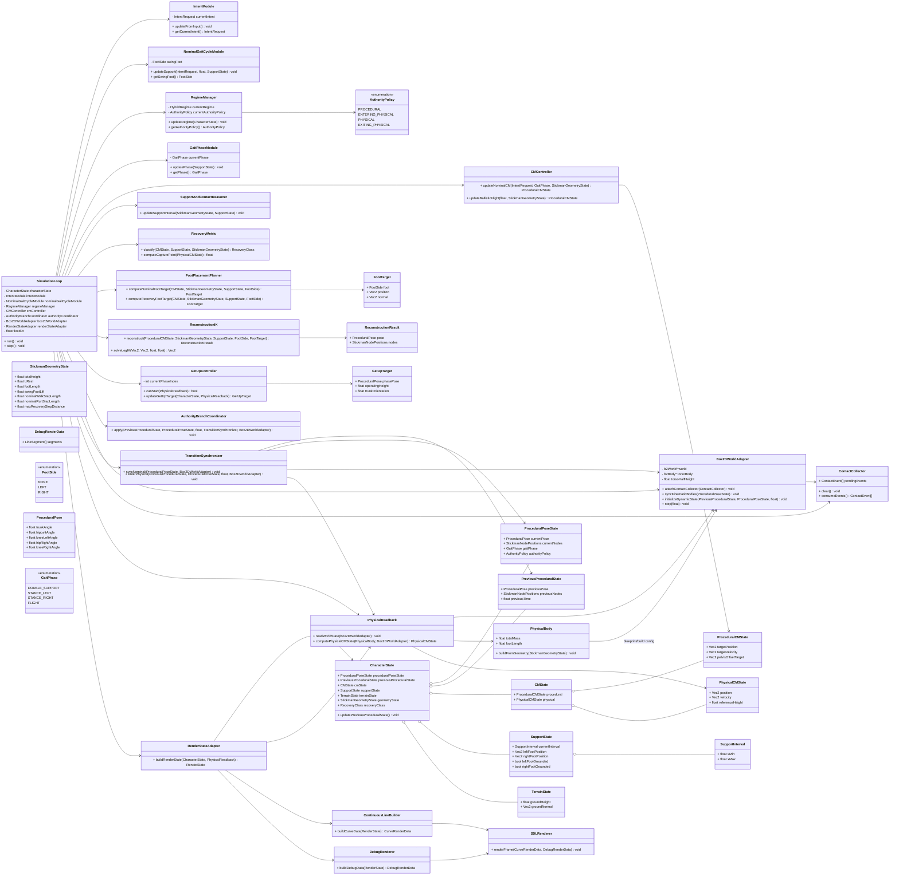
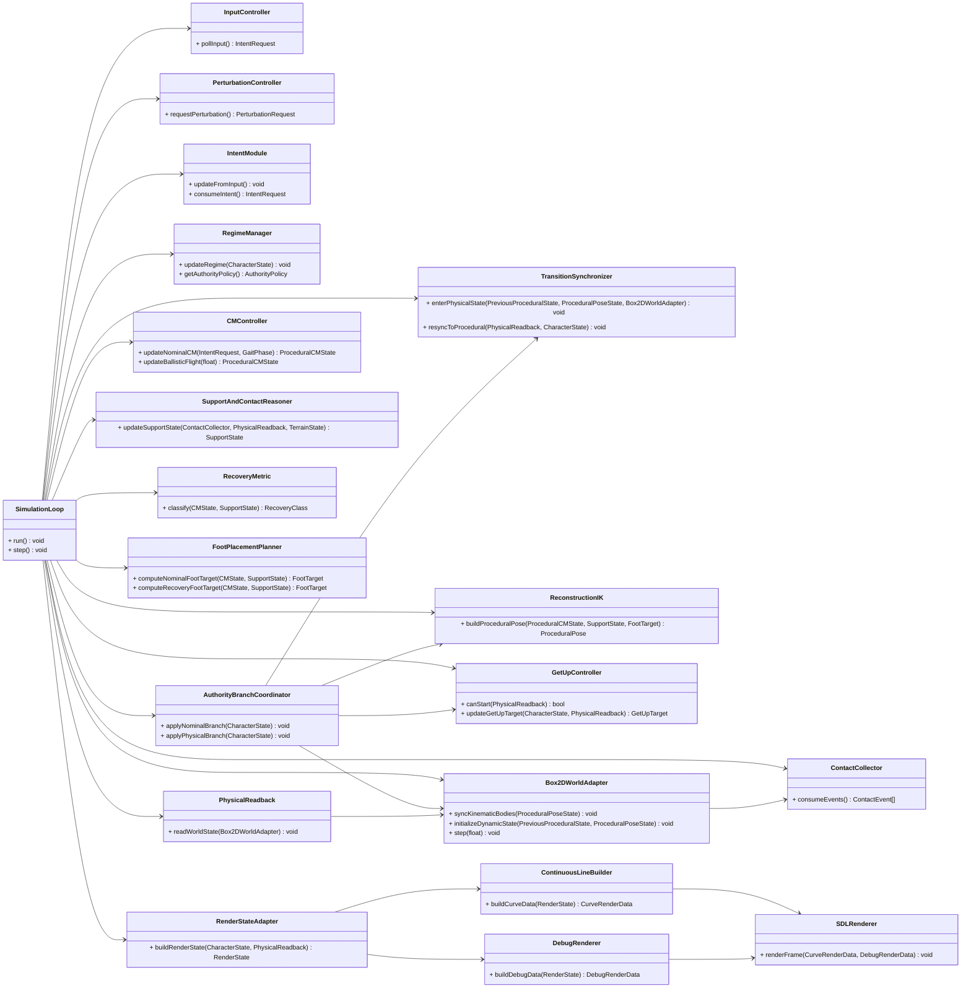
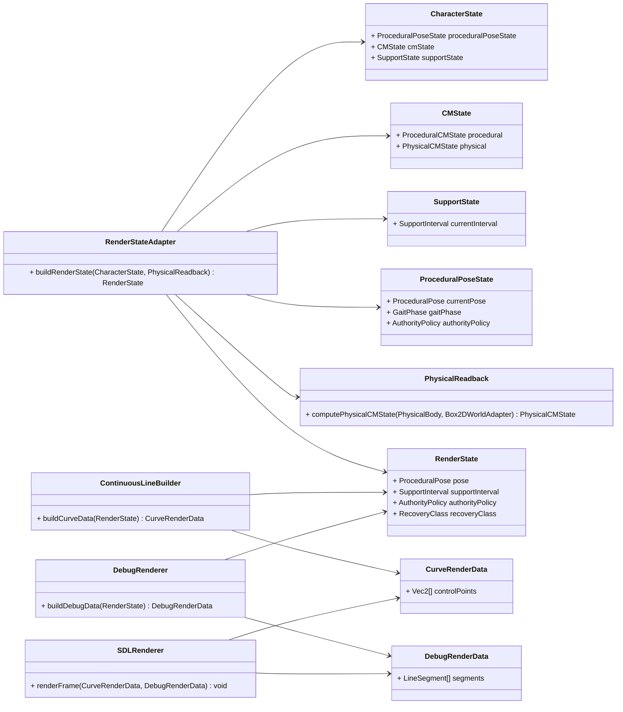

# Class Diagram

## Implementation Alignment Note

This document is now a **historical conceptual UML draft**, not the primary source of truth for
midpoint coding.

For actual implementation, the following documents take precedence:

- [`../implementation/01_Runtime_Architecture.md`](../implementation/01_Runtime_Architecture.md)
- [`../implementation/02_State_Model.md`](../implementation/02_State_Model.md)
- [`../implementation/04_Source_Tree_And_Ownership.md`](../implementation/04_Source_Tree_And_Ownership.md)
- [`../implementation/06_Design_To_Implementation_Mapping.md`](../implementation/06_Design_To_Implementation_Mapping.md)

Important interpretation rules when reading this draft:

- the old UML `SimulationLoop` is conceptually split in implementation
- `RenderStateAdapter` is the canonical view-adapter name
- midpoint keeps `GaitPhase` as a dedicated support-cycle type
- midpoint keeps dual `CMState`
- midpoint does not activate the Box2D runtime branch

This file should therefore be used for conceptual relationships, not for constructor-by-constructor
coding decisions.

---

## 1. Role of This Document

This document is the first **class-diagram draft** derived from the design dossier.

Its goal is not to freeze every method signature yet.
Its goal is to turn the validated module structure into a concrete UML-oriented view that can guide:

* the future formal class diagram
* the first implementation skeleton
* constructor and dependency decisions

The diagrams below use class notation even when some elements may later become:

* plain state structs
* service objects
* adapters
* coordinators

That is acceptable at this stage.

---

## 2. Reading Conventions

The diagrams follow these conventions:

* **State classes** mainly store persistent simulation truth.
* **Logic classes** mainly compute, decide, or coordinate.
* **Adapter classes** isolate external libraries such as Box2D and SDL.
* **Value types** are explicit data objects passed between modules.

The direction of dependencies should remain consistent with [13_Modules_And_Responsibilities.md](13_Modules_And_Responsibilities.md).

---

## 3. V1 Reduced Class Diagram

The diagram below is the **recommended V1 class diagram base**.
It is intentionally simpler than the full module dossier.
Its purpose is to keep only the classes and value types that are most likely to exist explicitly in the first implementation, while already showing representative members and operations.

---

## 4. High-Level Runtime Diagram

---

## 5. Core Model Diagram

```mermaid
classDiagram
direction TB

class CharacterState {
  + StickmanGeometryState geometryState
  + ProceduralPoseState proceduralPoseState
  + PreviousProceduralState previousProceduralState
  + CMState cmState
  + SupportState supportState
  + TerrainState terrainState
}

class StickmanGeometryState {
  + float totalHeight
  + float L_rest
}

class ProceduralPoseState {
  + ProceduralPose currentPose
  + GaitPhase gaitPhase
  + AuthorityPolicy authorityPolicy
}

class PreviousProceduralState {
  + ProceduralPose previousPose
  + float previousTime
}

class CMState {
  + ProceduralCMState procedural
  + PhysicalCMState physical
}

class ProceduralCMState {
  + Vec2 targetPosition
  + Vec2 targetVelocity
  + Vec2 pelvisOffsetTarget
}

class PhysicalCMState {
  + Vec2 position
  + Vec2 velocity
  + float referenceHeight
}

class SupportState {
  + SupportInterval currentInterval
  + bool leftFootGrounded
  + bool rightFootGrounded
}

class TerrainState {
  + float groundHeight
  + Vec2 groundNormal
}

class IntentModule {
  + consumeIntent() IntentRequest
}

class GaitPhaseModule {
  + updatePhase(SupportState) void
}

class RegimeManager {
  + updateRegime(CharacterState) void
}

class CMController {
  + updateNominalCM(IntentRequest, GaitPhase) ProceduralCMState
}

class SupportAndContactReasoner {
  + updateSupportState(ContactCollector, PhysicalReadback, TerrainState) SupportState
}

class RecoveryMetric {
  + classify(CMState, SupportState) RecoveryClass
}

class FootPlacementPlanner {
  + computeNominalFootTarget(CMState, SupportState) FootTarget
}

class ReconstructionIK {
  + buildProceduralPose(ProceduralCMState, SupportState, FootTarget) ProceduralPose
}

class GetUpController {
  + updateGetUpTarget(CharacterState, PhysicalReadback) GetUpTarget
}

class TransitionSynchronizer {
  + enterPhysicalState(PreviousProceduralState, ProceduralPoseState, Box2DWorldAdapter) void
  + resyncToProcedural(PhysicalReadback, CharacterState) void
}

class PhysicalBody {
  + float totalMass
  + float footLength
}

class Box2DWorldAdapter {
  + step(float) void
}

class PhysicalReadback {
  + computePhysicalCMState(PhysicalBody, Box2DWorldAdapter) PhysicalCMState
}

class ContactCollector {
  + consumeEvents() ContactEvent[]
}

class FootTarget {
  + Vec2 position
  + Vec2 normal
}

class GetUpTarget {
  + ProceduralPose phasePose
  + float operatingHeight
}

class ProceduralPose {
  + float trunkAngle
  + float hipLeftAngle
  + float kneeLeftAngle
  + float hipRightAngle
  + float kneeRightAngle
}

class SupportInterval {
  + float xMin
  + float xMax
}

class AuthorityPolicy {
  <<enumeration>>
  PROCEDURAL
  ENTERING_PHYSICAL
  PHYSICAL
  EXITING_PHYSICAL
}

CharacterState o-- StickmanGeometryState
CharacterState o-- ProceduralPoseState
CharacterState o-- PreviousProceduralState
CharacterState o-- CMState
CharacterState o-- SupportState
CharacterState o-- TerrainState

CMState o-- ProceduralCMState
CMState o-- PhysicalCMState
SupportState o-- SupportInterval

IntentModule --> CharacterState
GaitPhaseModule --> CharacterState
RegimeManager --> CharacterState
RegimeManager --> AuthorityPolicy

CMController --> ProceduralCMState
SupportAndContactReasoner --> SupportState
SupportAndContactReasoner --> ContactCollector
SupportAndContactReasoner --> PhysicalReadback
SupportAndContactReasoner --> TerrainState

RecoveryMetric --> CMState
RecoveryMetric --> SupportState

FootPlacementPlanner --> FootTarget
FootPlacementPlanner --> CMState
FootPlacementPlanner --> SupportState
FootPlacementPlanner --> TerrainState

ReconstructionIK --> ProceduralPose
ReconstructionIK --> ProceduralCMState
ReconstructionIK --> SupportState
ReconstructionIK --> FootTarget

GetUpController --> GetUpTarget
GetUpController --> PhysicalReadback
GetUpController --> CharacterState

TransitionSynchronizer --> PreviousProceduralState
TransitionSynchronizer --> ProceduralPoseState
TransitionSynchronizer --> Box2DWorldAdapter
TransitionSynchronizer --> PhysicalReadback

PhysicalBody --> Box2DWorldAdapter : blueprint/build config
Box2DWorldAdapter --> ContactCollector
PhysicalReadback --> Box2DWorldAdapter
PhysicalReadback --> PhysicalBody
PhysicalReadback --> PhysicalCMState
```

---

## 6. View Diagram

---

## 7. Key Value Types

These are the most important non-service types already implied by the dossier:

* `ProceduralCMState`
* `PhysicalCMState`
* `SupportInterval`
* `FootTarget`
* `ProceduralPose`
* `GetUpTarget`
* `AuthorityPolicy`
* `GaitPhase`
* `RenderState`
* `StickmanGeometryState`
* `StickmanNodePositions`
* `RecoveryClass`

At implementation time, some of these will likely be lightweight structs rather than heavy classes.

---

## 8. Practical Interpretation

The most important structural decisions captured by this draft are:

* `Box2DWorldAdapter` owns the live Box2D world and runtime bodies.
* `PhysicalBody` remains a body blueprint, not the owner of runtime Box2D objects.
* `PhysicalReadback` is the producer of `PhysicalCMState`.
* `CMState` explicitly separates procedural and physical CM truths.
* `GetUpController` is a real module and not an implicit branch hidden inside reconstruction.
* `TransitionSynchronizer` is the explicit bridge between procedural and physical authority.

---

## 9. What Still Remains for the Final UML Version

The following are still intentionally deferred to the next class-design pass:

* exact constructor signatures and ownership syntax
* complete attribute lists for every secondary class
* complete method lists for every secondary class
* detailed visibility choices for every member
* whether some pairs of modules should be merged in code
* whether some value types become nested structs or standalone classes

This is acceptable.
At this point, the architecture is already concrete enough that the final UML work should be mostly mechanical.
