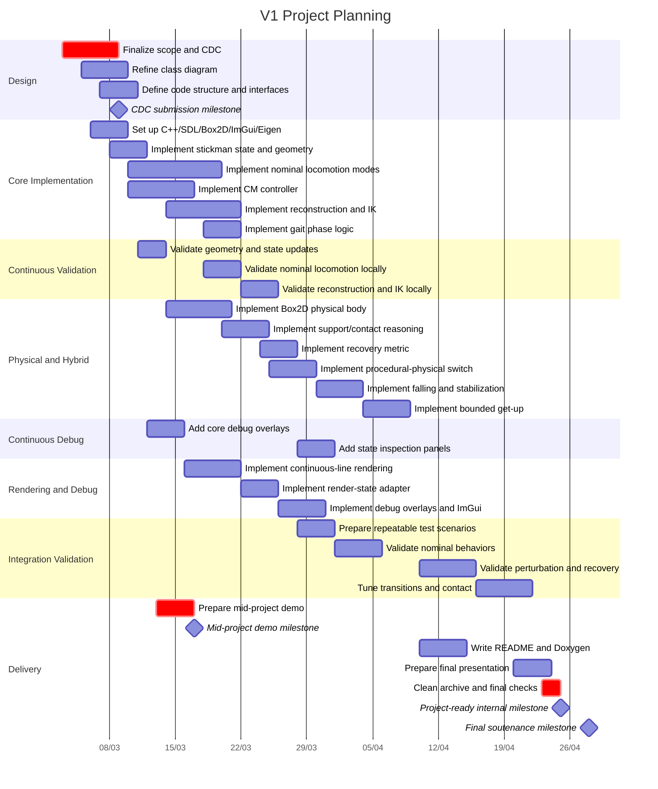

# Gantt Diagram

## 1. Role of This Document

This document provides the planning structure of the project in a form compatible with the future course deliverable.

It is based on the task breakdown defined in [Cahier_des_Charges.md](/home/tomas/UL1/LIFAPCD/phy/doc/cahier_des_charges/Cahier_des_Charges.md).

The planning must now respect the following course milestones:

* `2026-03-09`: cahier des charges
* `2026-03-17`: mid-project demo
* `2026-04-28`: final soutenance

The internal objective of the group is to have the project functionally ready by:

* `2026-04-25`

At this stage, what matters most is:

* task ordering
* major dependencies
* workload grouping

---

## 2. V1 Planning with Course Milestones

---

## 3. Practical Reading

The plan is intentionally organized in overlapping streams:

* design
* core implementation
* physical/hybrid behavior
* rendering/debug
* validation
* delivery

This reflects the fact that the project is not purely sequential.
Some technical parts can advance in parallel once the design foundation is stable enough.
It also reflects an important project rule: validation and debugging should happen continuously during development, not only at the end.
It also reflects the academic constraint that the project must be document-ready on `2026-03-09`, demo-ready on `2026-03-17`, and functionally ready before `2026-04-25`.

---

## 4. Approximate Task Ownership

The following responsibility split is approximate and may evolve during implementation, but it already provides a readable basis for the course deliverable:

* **Tomas Delon**: overall integration, conception documents, class diagram, CM-related logic, reconstruction/IK, and final technical consistency
* **Maleik**: physical body, Box2D integration, support/contact handling, recovery logic, and hybrid transitions
* **Gedik**: SDL rendering, continuous-line visual representation, Dear ImGui debug tools, and presentation-oriented visual polish

Some tasks are naturally shared:

* validation and debugging
* integration of nominal and physical behaviors
* final documentation and delivery preparation

---

## 5. Expected Mid-Project Demo

The `mi-parcours` presentation on `2026-03-17` is expected to show a coherent partial prototype rather than the full V1 feature set.

The realistic target for that milestone is:

* a project that builds and runs correctly
* an SDL window with the initial stickman representation
* the first version of the state and geometry pipeline
* at least a partial nominal behavior, such as standing and an initial locomotion behavior
* early reconstruction/IK integration
* initial debug overlays or inspection tools useful for demonstration

This milestone is intended to prove that the technical base is functional and that the main architectural choices are already implementable.

---

## 6. Future Update

Before final submission, this planning should be updated into a final Gantt diagram that:

* reflects the real work done
* identifies who contributed to which tasks
* is exportable in an image or PDF format suitable for the course deliverable
